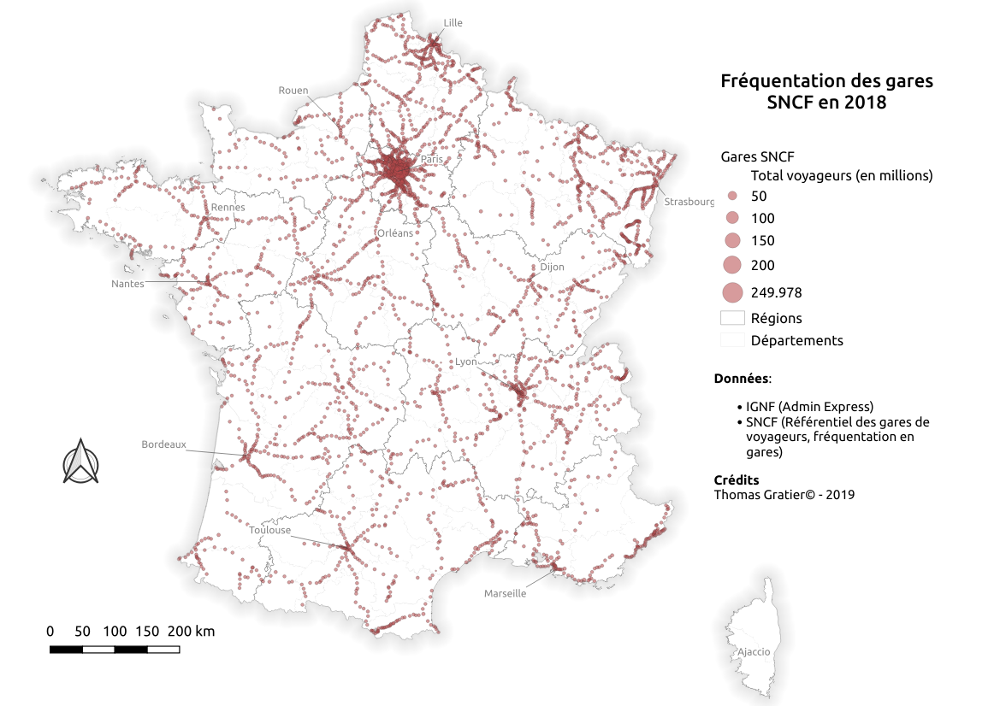
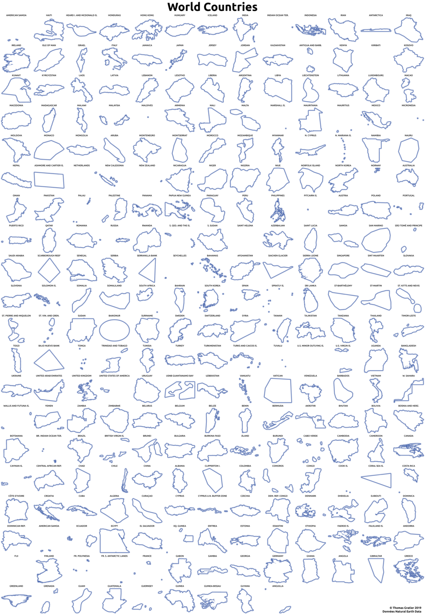
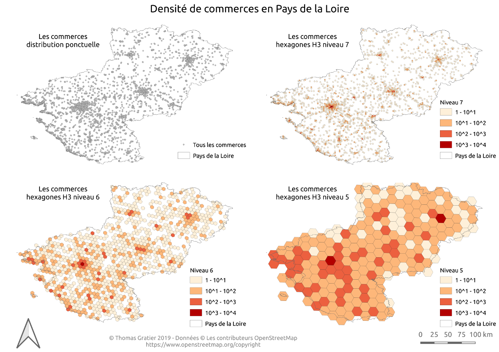

# #30DayMapChallenge

Original idea from https://twitter.com/tjukanov/status/1187713840550744066

Starting from November, make a map following the schedule below:

## Day and thematic

- [x] 1. Points

  

- [x] 2. Lines

  

- [x] 3. Polygons

  

  High resolution image available in `day3_polygons` directory

- [x] 4. Hexagons(!)

  

- [ ] 5. Raster
- [ ] 6. Blue
- [ ] 7. Red
- [ ] 8. Green
- [ ] 9. Yellow
- [ ] 10. Black and white
- [ ] 11. Elevation
- [ ] 12. Movement
- [ ] 13. Tracks
- [ ] 14. Boundaries
- [ ] 15. Names
- [ ] 16. Places
- [ ] 17. Zones
- [ ] 18. Globe
- [ ] 19. Urban
- [ ] 20. Rural
- [ ] 21. Environment
- [ ] 22. Built environment
- [ ] 23. Population
- [ ] 24. Statistics
- [ ] 25. Climate
- [ ] 26. Hydrology
- [ ] 27. Resources
- [ ] 28. Funny
- [ ] 29. Experimental
- [ ] 30. Home